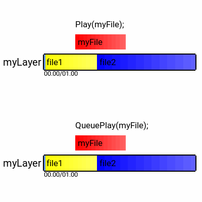
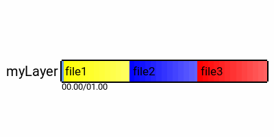

# Sound Manager (Emotion.Sound.SoundManager)

_Last Updated: Build 254_

The sound manager is an Emotion context module accessible globally through `Context.SoundManager`. It provides you with the ability to play audio. Its classes can be found under the `Emotion.Sound` namespace.

## Loading Audio

To play audio you will need to load a `SoundFile` asset using the `AssetLoader`. Currently the only supported format is `WAV`.

_ex. `Context.AssetLoader.Get<SoundFile>("Sounds/mySound.wav");`_

## Playing Audio

Audio in Emotion is played on layers, allowing you to play multiple tracks at the same time. For instance one layer can be your background music which will loop, while another can play your special effects. Layers are accessed through their string name. To access a layer use `Context.SoundManager.GetLayer("myLayer");`, if the layer doesn't exist it will be created when either accessed or a file is played on it. You never have to explicitly create one, but can destroy them using `Context.SoundManager.RemoveLayer("myLayer")`.

When playing a loaded `SoundFile` on a layer you have two choices. You can either "play" it or "queue" it. The first option will stop whatever tracks are playing currently and play the newly provided track, while the second one will queue the track to be played (seamlessly) once the first finishes. The former can be achieved through the `Context.SoundManager.Play(mySound, "myLayer");` function on the `SoundManager` or by using the layer's API directly - `myLayer.Play(mySound);`. The latter uses the `Context.SoundManager.QueuePlay(mySound, "myLayer");` and `layer.QueuePlay(mySound);` APIs respectively.

Both methods of playing are not guaranteed to immediately start playing your file and are considered async functions which return a `Task` object. **The task is resolved once the track is queued, and not once it's played.**

**Note: While a layer can play both stereo and mono tracks, it cannot queue both on the same layer. You can check the channels of your track using the `Channels` property of the `SoundFile` class.**

## Controlling Audio

While the playlist is playing you can modify its state.

By using the `Looping` property you can set whether the playlist should loop. If true the whole playlist will begin playing from the start as soon as it finishes. Changing this property does not modify the current state in any way. The `LoopLastOnly` property controls whether the whole playlist will loop or just the lack track. **By default this is on.** Changing it also does not modify playing state in any way.

You can invoke the `Pause()` function on the layer to pause playback, and the `Resume()` function to resume. You can only pause a layer in `Playing` status, and you can resume a layer in `Paused` status. If you play a track on a paused layer it will be resumed. If you queue a track on a paused layer, it will be added to the back of the playlist as usual and the layer will remain paused.

You can change the relative volume of the layer using the `Volume` property, and the volume of all sound using the `Context.Settings.SoundSettings.Volume` property. While the global volume's value must be between 0 and 100, the layer's volume can extend further - boosting the gain.

**Note: Another state of pause is `FocusLossPause` which is applied automatically when the host loses focus and the layer is in Playing status. Any commands issued during this state are not run until the host regains focus.**

## Fading

You can apply fade in and fade out effects to the layer as well. By changing the `FadeInLength` and `FadeOutLength` properties you can set how long the effects should be in seconds. By default both are set to 0. Changing these properties while a layer is already playing won't break anything, but is audible if currently fading due to the instant increase/decrease of volume. If both properties overwrite, i.e. both are set to 2 seconds on a 3 second track, they will multiply additively - this is not recommended.

Additional properties allow you to further customize your effect. The `FadeInFirstLoopOnly` property which is off by default makes the fade in effect apply only on the first loop. Both effects are only applied to the first/last track in a playlist and will not cause queued tracks to fade in/out as well, this conforms with the philosophy that a playlist of queued files should be treated as a single track.

By setting the `FadeOutOnChange` property to true your tracks will fade out when a new one is played. This means your `Play` and `StopPlayingAll` commands will no longer take effect instantly but cause a fade out with the duration of `FadeOutLength` before applying. If you'd like to use `FadeOutOnChange` without the track fading out normally when its over (for instance because you're looping) you can set the `SkipNaturalFadeOut` property to true. Queuing will not cause fade outs.

## Monitoring

You can check what file is being played through the `CurrentlyPlayingFile` property on the layer. This will return a direct reference to the `SoundFile` being played. Additionally you can access the list of queued files on the layer using the `Playlist` property.

The `Status` property will return one of these states:

- Initial - This is the state the layer is in before any operations are performed on it.
- Playing - The layer is playing a track.
- Paused - The layer is paused.
- Stopped - The layer has either finished playing all queued tracks or was explicitly stopped.
- FocusLossPause - An internal state for when the layer is paused because the host lost focus.

Through the `PlaybackLocation` and `TotalDuration` properties you can monitor the progress of the tracks on the layer. The `TotalDuration` property is the sum of the durations of all queued tracks in the playlist, while the `PlaybackLocation` property is the progress within **that** timeframe. Both properties, as the `SoundFile`'s `Duration` property are in seconds.

**Note: When a track finishes playing it is removed from the playlist, unless it will loop. That means its duration is subtracted from the total duration and current playback location.**

## Deep Dive

The `SoundManager` uses OpenAL in the background. All actions are executed on a specified thread where the audio context is created and is managed through the `ThreadManager` class - accessible by the global `ALThread` class. The AL loop's frequency is controlled by the `Context.Flags.SoundThreadFrequency` flag and is 50 milliseconds by default. **The ALThread does not run while the host is unfocused, but layers will still be updated.**

AL errors are checked every tick and will cause the engine to crash. Additionally monitoring properties of the layer, such as `Status`, `PlaybackLocation`, `ReportedVolume`, `CurrentlyPlayingFile`, `TotalDuration`, and the removal of playlist tracks are updated on the ALThread, which means the values you can access are cached copies.

The creation and cleanup of `SoundFile` assets is also managed by the `SoundManager`. When the `AssetLoader` destroys a `SoundFile` it unlinks it, but it is added to a list of tracks to be destroyed once they are no longer in use. This means that in an endlessly looping layer the track will **never** be cleaned up from memory.

To allow seamless playing the audio buffers Emotion uses are all "streaming", which means the files are queued and streamed to the audio device.

## References

- [Sound Tests](https://github.com/Cryru/Emotion/blob/master/Emotion.Tests/src/Tests/Sound.cs)
- [Emotion.Sound Namespace](https://github.com/Cryru/Emotion/tree/master/EmotionCore/src/Sound)
- [SoundManager.cs](https://github.com/Cryru/Emotion/blob/master/EmotionCore/src/Sound/SoundManager.cs)
- [SoundLayer.cs](https://github.com/Cryru/Emotion/blob/master/EmotionCore/src/Sound/SoundLayer.cs)
- [SoundFile.cs](https://github.com/Cryru/Emotion/blob/master/EmotionCore/src/Sound/SoundFile.cs)

## Todo

- Add test for one file on multiple layers